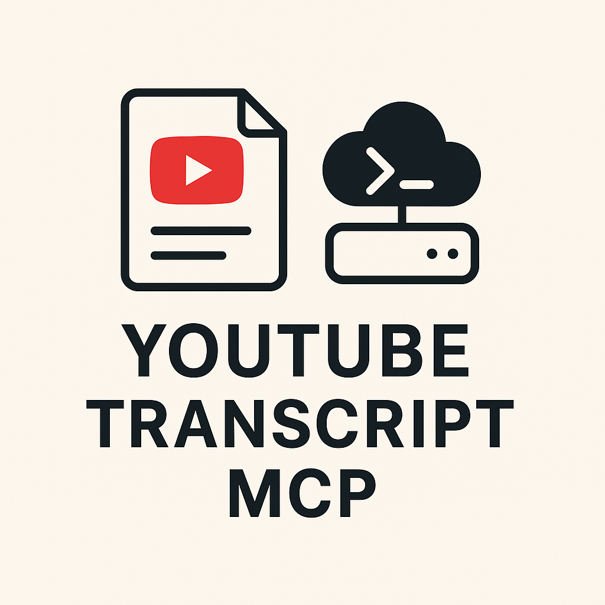

<div align="center">
  
  
  # YouTube Transcript Remote MCP Server

  The **first remote** Model Context Protocol (MCP) server that enables Claude AI to extract transcripts from YouTube videos. This server offers zero-setup access for users on any platform including mobile devices.
</div>

[](https://deploy.workers.cloudflare.com/?url=https://github.com/ergut/youtube-transcript-mcp)

## 🌟 Features

- **Zero Local Setup**: No installation required - works directly from the cloud
- **Universal Access**: Works on desktop, mobile, and web versions of Claude
- **Smart Caching**: Efficient caching system using Cloudflare KV for fast responses
- **Multi-language Support**: Extract transcripts in different languages
- **Error Handling**: Robust error handling with user-friendly messages
- **Analytics**: Built-in request tracking and usage analytics
- **URL Flexibility**: Handles all YouTube URL formats (youtube.com, youtu.be, m.youtube.com, etc.)

## 🚀 Quick Start

### Option 1: Use Our Hosted Server (Recommended)

The easiest way to get started - just add our public server to your Claude Desktop:

#### For Claude Desktop Users

1. **Open Claude Desktop Settings**
   - Click on "Claude" in the menu bar → "Settings"
   - Navigate to "Developer" tab
   - Click "Edit Config"

2. **Add the MCP Server Configuration**
   
   Add this to your `claude_desktop_config.json`:

   ```json
   {
     "mcpServers": {
       "youtube-transcript": {
         "command": "npx",
         "args": [
           "mcp-remote",
           "https://youtube-transcript-mcp.ergut.workers.dev/sse"
         ]
       }
     }
   }
   ```

3. **Restart Claude Desktop**
   
   After saving the config file, restart Claude Desktop to load the server.

4. **Verify Installation**
   
   Look for the tools icon (🔧) in the chat interface. You should see the `get_transcript` tool available.

### Option 2: Deploy Your Own

Want to run your own instance? Deploy to Cloudflare Workers in one click:

[](https://deploy.workers.cloudflare.com/?url=https://github.com/ergut/youtube-transcript-mcp)

Or manually:

```bash
git clone https://github.com/ergut/youtube-transcript-mcp
cd youtube-transcript-mcp
npm install
npm run deploy
```

### For Other MCP Clients

The server supports the standard MCP protocol and can be used with any compatible client:

- **Public Server URL**: `https://youtube-transcript-mcp.ergut.workers.dev/sse`
- **Transport**: Server-Sent Events (SSE) or HTTP
- **Authentication**: None required (public server)

## 📖 Usage Examples

### Basic Transcript Extraction

```
Extract the transcript from this YouTube video: https://www.youtube.com/watch?v=dQw4w9WgXcQ
```

### Multi-language Support

```
Can you get the transcript of this video in Turkish: https://youtu.be/VIDEO_ID
```

```
Extract the Spanish transcript from: https://www.youtube.com/watch?v=VIDEO_ID
```

### Supported URL Formats

The server automatically handles all YouTube URL formats:

- `https://www.youtube.com/watch?v=VIDEO_ID`
- `https://youtu.be/VIDEO_ID`
- `https://m.youtube.com/watch?v=VIDEO_ID`
- `https://www.youtube.com/live/VIDEO_ID`
- `https://www.youtube.com/embed/VIDEO_ID`
- `https://www.youtube.com/shorts/VIDEO_ID`
- International domains (`youtube.co.uk`, `youtube.de`, etc.)

All tracking parameters (like `?si=`, `&t=`, etc.) are automatically removed.

## 🛠 Available Tools

### `get_transcript`

Extracts the transcript from a YouTube video URL.

**Parameters:**
- `url` (required): YouTube video URL in any format
- `language` (optional): Language code for the transcript (e.g., 'en', 'es', 'fr'). Defaults to 'en'.

**Example Usage:**
```json
{
  "name": "get_transcript",
  "arguments": {
    "url": "https://www.youtube.com/watch?v=dQw4w9WgXcQ",
    "language": "en"
  }
}
```

## 🔧 Advanced Configuration

### Debug Logging

To enable detailed logging for troubleshooting:

```json
{
  "mcpServers": {
    "youtube-transcript": {
      "command": "npx",
      "args": [
        "mcp-remote",
        "https://youtube-transcript-mcp.ergut.workers.dev/sse",
        "--debug"
      ]
    }
  }
}
```

Debug logs will be created in `~/.mcp-auth/{server_hash}_debug.log`.

### HTTP Transport Only

To force HTTP transport instead of SSE:

```json
{
  "mcpServers": {
    "youtube-transcript": {
      "command": "npx",
      "args": [
        "mcp-remote",
        "https://youtube-transcript-mcp.ergut.workers.dev/mcp",
        "--transport",
        "http-only"
      ]
    }
  }
}
```

## 📊 Server Information

- **Hosting**: Cloudflare Workers
- **Caching**: Cloudflare KV with 7-day cache for successful transcripts
- **Rate Limiting**: Built-in retry logic with exponential backoff
- **Uptime**: 99.9%+ availability through Cloudflare's global network
- **Response Time**: Typically <3 seconds for cached content, <10 seconds for new requests

## 🚨 Error Handling

The server provides clear error messages for common issues:

- **"Invalid YouTube URL provided"**: The URL format is not recognized
- **"No transcript available for this video"**: Video has no captions/transcript
- **"Video not found or private"**: Video is private, deleted, or doesn't exist
- **"Service temporarily busy, try again in a few minutes"**: Rate limiting from YouTube
- **"Transcripts are disabled for this video"**: Creator has disabled captions

## 🌍 Language Support

The server supports any language that YouTube provides transcripts for. Common language codes:

- `en` - English (default)
- `tr` - Turkish
- `es` - Spanish
- `fr` - French
- `de` - German
- `it` - Italian
- `pt` - Portuguese
- `ja` - Japanese
- `ko` - Korean
- `zh` - Chinese

## 🔒 Privacy & Security

- **No Authentication Required**: Public server for ease of use
- **No Data Storage**: Transcripts are cached temporarily for performance only
- **No Personal Information**: Only YouTube video IDs and transcripts are processed
- **HTTPS Only**: All communications are encrypted
- **CORS Enabled**: Supports web-based MCP clients

## 🚀 API Endpoints

For developers who want to integrate directly:

### HTTP POST `/mcp`
Standard MCP JSON-RPC endpoint for direct integration.

### Server-Sent Events `/sse`
MCP SSE transport endpoint for real-time communication.

### Info `/`
Server information and status endpoint.

**Example Direct API Call:**
```bash
curl -X POST https://youtube-transcript-mcp.ergut.workers.dev/mcp \
  -H "Content-Type: application/json" \
  -d '{
    "jsonrpc": "2.0",
    "id": 1,
    "method": "tools/call",
    "params": {
      "name": "get_transcript",
      "arguments": {
        "url": "https://www.youtube.com/watch?v=dQw4w9WgXcQ",
        "language": "en"
      }
    }
  }'
```

## 🐛 Troubleshooting

### Common Issues

1. **"Connection Error" in Claude Desktop**
   - Ensure you have the latest Claude Desktop version
   - Check that `mcp-remote` is properly configured
   - Try adding `--debug` flag to see detailed logs

2. **"Could not attach to MCP server"**
   - Verify your internet connection
   - Check the server URL is correct
   - Restart Claude Desktop after config changes

3. **No transcript returned**
   - Verify the YouTube URL is valid and accessible
   - Check if the video has captions enabled
   - Try a different language code if available

### Getting Help

- **Check logs**: Look in `~/.mcp-auth/` for debug logs
- **Test direct connection**: Use `npx -p mcp-remote@latest mcp-remote-client https://youtube-transcript-mcp.ergut.workers.dev/sse`
- **Verify server status**: Visit `https://youtube-transcript-mcp.ergut.workers.dev/`
- **Open an issue**: [GitHub Issues](https://github.com/ergut/youtube-transcript-mcp/issues)

## 🤝 Contributing

This is an open-source project. Contributions are welcome!

- **Report Issues**: Found a bug? Please [open an issue](https://github.com/ergut/youtube-transcript-mcp/issues)
- **Feature Requests**: Have ideas for improvements? Let us know!
- **Code Contributions**: PRs welcome for enhancements

### Development Setup

```bash
git clone https://github.com/ergut/youtube-transcript-mcp
cd youtube-transcript-mcp
npm install
npm run dev
```

## 📜 License

This project is open source and available under the [MIT License](LICENSE).

## 🙏 Acknowledgments

- Built with the [Model Context Protocol](https://modelcontextprotocol.io/) by Anthropic
- Hosted on [Cloudflare Workers](https://workers.cloudflare.com/)
- Uses the [youtube-transcript](https://www.npmjs.com/package/youtube-transcript) library
- Inspired by the MCP community and existing local transcript servers

---

**Ready to supercharge Claude with YouTube transcript extraction?** Add this server to your Claude Desktop configuration and start extracting transcripts from any YouTube video instantly! 🎉
